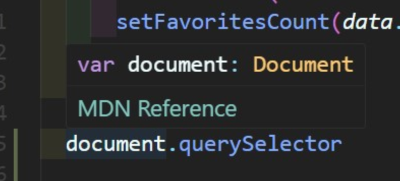
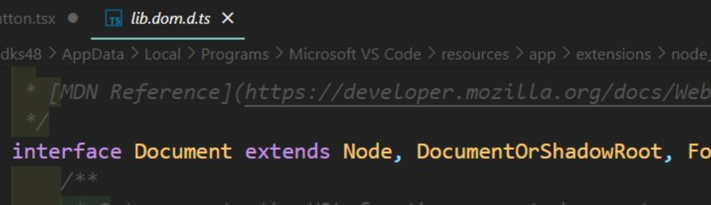

# **아이템35. 데이터가 아닌, API와 명세를 보고 타입 만들기**

### 예시 데이터를 참고하여 타입 생성 vs 명세를 참고해 타입 생성

##### 예시 데이터를 참고해 타입 생성을 한다면?

- 눈 앞에 있는 데이터들만 고려하게 되므로 예기치 못한 오류가 발생할 수 있다.

##### 명세를 참고해 타입 생성

- 타입스크립트는 사용자가 실수를 줄일 수 있게 도와준다.
- [DefinitelyTyped](https://github.com/DefinitelyTyped/DefinitelyTyped/blob/master/README.ko.md)에 정의된 것을 활용하는 방법이 있다.

```ts
// Feature 타입이 정의된 적이 없다.
// 하지만, geometry에 coordinates라는 속성이 있다고 가정한 것이 문제다.
// 하지만 공식 GeoJSON 명세가 있으니 명세를 사용하자.
function focusOnFeature(f: Feature) {
  const bounds = calculateBoudingBox(f);
  const camera = viewportForBounds(bounds);
  setCamera(camera);
  const {
    center: { lat, lng },
    zoom,
  } = camera;
  zoom;
  window.location.search = `?v=@${lat},${lng}z${zoom}`;
}
```

```ts
function calculateBoundingBox(f: Feature): BoundingBox | null {
  let box: BoundingBox | null = null;

  const helper = (coords: any[]) => {
    // ...
  };

  const { geometry } = f;
  if (geometry) {
    helper(geometry.coordinates);
  }

  return box;
}
```

### DefinitelyTyped는 무엇이고 어떻게 사용하는 걸까?

- DefinitelyTyped : 아주 큰 깃허브 레퍼지토리로, 모든 유명한 npm 라이브러리를 가지고 있는 저장소이다. 여기서 TypeScript로 작업할 때 필요한 대부분의 라이브러리나 패키지의 type definition을 얻을 수 있다.
- DefinitelyTyped로 geojson 설치 : `$ npm install --save-dev @types/geojson`
- DefinitelyTyped로 geojson의 Feature 타입 사용 : `import { Feature } from 'geojson';`

### DefinitelyTyped로 확인하는 명세 기반 타입 작성이 좋은 이유

https://pseudo-lab.github.io/Tutorial-Book/chapters/object-detection/Ch1-Object-Detection.html#:~:text=%EB%B0%94%EC%9A%B4%EB%94%A9%20%EB%B0%95%EC%8A%A4%EB%8A%94%20%ED%8A%B9%EC%A0%95%20%EC%82%AC%EB%AC%BC,%ED%95%98%EC%97%AC%20%EC%82%AC%EA%B0%81%ED%98%95%EC%9C%BC%EB%A1%9C%20%ED%91%9C%ED%98%84%ED%95%A9%EB%8B%88%EB%8B%A4.

```ts
import { Feature } from "geojson";

function calculateBoundingBox(f: Feature): BoundingBox | null {
  let box: BoundingBox | null = null;

  const helper = (coords: any[]) => {
    //...
  };

  const { geometry } = f;
  if (geometry) {
    // geometry가 GeometryCollection(다양한 도형 모음) 타입이 될 수도 있는데
    // GeometryCollection에는 coordinates 속성이 없기 때문에 에러 발생.
    helper(geometry.coordinates); // 에러 발생.
  }

  return box;
}
```

```ts
/** DefinitelyTyped로 확인하는 Feature 타입 정의 */
// Feature 타입 정의
export interface Feature<
  G extends Geometry | null = Geometry,
  P = GeoJsonProperties
> extends GeoJsonObject {
  type: "Feature";
  geometry: G;
  id?: string | number | undefined;
  properties: P;
}

// Geometry 타입 정의
export type Geometry =
  | Point
  | MultiPoint
  | LineString
  | MultiLineString
  | Polygon
  | MultiPolygon
  | GeometryCollection;

// Geometry에서 언급된 타입 정의
export interface Point extends GeoJsonObject {
  type: "Point";
  coordinates: Position;
}

export interface MultiPoint extends GeoJsonObject {
  type: "MultiPoint";
  coordinates: Position[];
}

export interface LineString extends GeoJsonObject {
  type: "LineString";
  coordinates: Position[];
}

export interface MultiLineString extends GeoJsonObject {
  type: "MultiLineString";
  coordinates: Position[][];
}

export interface Polygon extends GeoJsonObject {
  type: "Polygon";
  coordinates: Position[][];
}

export interface MultiPolygon extends GeoJsonObject {
  type: "MultiPolygon";
  coordinates: Position[][][];
}

export interface GeometryCollection<G extends Geometry = Geometry>
  extends GeoJsonObject {
  type: "GeometryCollection";
  geometries: G[];
  // GeometryCollection에서는 coordinates 속성이 없다.
}
```

에러 해결 해보자

```ts
// 타입을 체크하는 방법 이용
// 하지만 특정 타입 차단보다는 모든 타입을 지원하는 방법이 더 좋다.
const { geometry } = f;
if (geometry) {
  if (geometry.type === "GeometryCollection") {
    throw new Error("GeometryCollections are not supported");
  }
  helper(geometry.coordinates); // 정상
}
```

모든 타입을 지원하는 방법으로 수정해보자

```ts
const geometryHelper = (g: Geometry) => {
  if (geometry.type === "GeometryCollection") {
    geometry.geometries.forEach(geometryHelper);
  } else {
    helper(geometry.coordinates); // 정상
  }
};

const { geometry } = f;
if (geometry) {
  geometryHelper(geometry); // 정상
}
```

- 직접 타입을 선언해 작성했다면 GeometryCollection같은 예외 상황이 포함되지 않았을 것.
- 명세 기반으로 타입 작성을 하면 현재까지 경험한 데이터 + 사용 가능한 모든 값에 대해서 작동한다는 확신을 가질 수 있다.

### API도 명세로부터 타입을 생성하는 것이 좋다.

- GraphQL API : 타입스크립트와 비슷한 타입 시스템을 사용하여, 가능한 모든 쿼리와 인터페이스를 명세하는 스키마로 구성.
- Apollo : GraphQL 쿼리를 타입스크립트 타입으로 변환해 주는 도구 중 하나.
  - 자동으로 타입 정보를 생성해주는 기능인 듯 하다.
  - 쿼리 변경 → 타입도 자동으로 변경 / 스키마 변경 → 타입도 자동으로 변경 (항상 일치)
  - 타입 정보를 자동으로 생성해 주어 API를 정확히 사용할 수 있도록 도와준다.

### 명세 정보나 공식 스키마가 없다면?

- 데이터로부터 타입을 생성해야 한다.
  - 생성된 타입이 실제 데이터와 일치하지 않을 수 있다는 점 주의.
  - `quicktype`같은 도구가 있다.

> quicktype은 JSON 객체를 입력하면 그 객체의 interface를 자동으로 만들어준다. ( https://velog.io/@code-bebop/quicktype-TypeScript의-매우-유용한-도우미 )

### 우리는 이미 자동 타입 생성의 이점을 누리고 있다?

- 브라우저 DOM API에 대한 타입 선언은 공식 인터페이스로부터 생성.
  - 복잡한 시스템을 정확히 모델링하고 타입스크립트가 오류나 코드상의 의도치 않은 실수를 잡을 수 있게 한다.
  - DOM API 타입 선언은 IDE에 포함되어 있기 때문에 잘 사용하면 됩니다!
  - DOM API) document.querySelector(), addEventListener() 등




## ⭐️ 2줄 요약

### 1. 코드의 구석 구석까지 타입 안정성을 얻기 위해 API 또는 데이터 형식에 대한 타입 생성을 고려해야 한다.

### 2. 데이터에 드러나지 않는 예외적인 경우들이 문제가 될 수 있기 때문에 데이터보다는 명세로부터 코드를 생성하는 것이 좋다.
