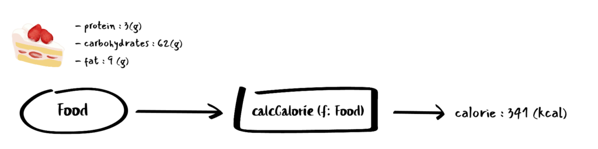
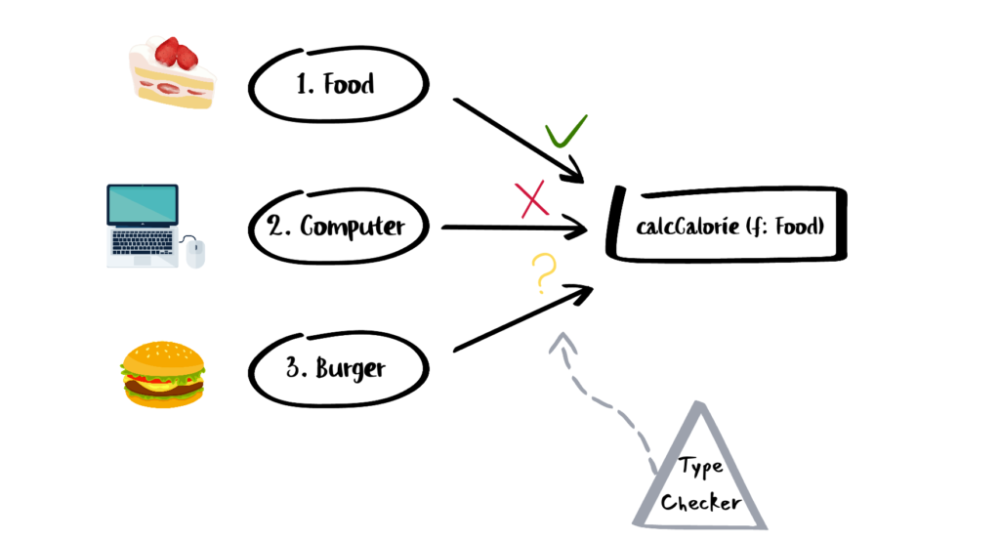

# **아이템37. 공식 명칭에는 상표를 붙이기**

## ⭐️ 2줄 요약

### 1. 타입스크립트는 구조적 타이핑(덕 타이핑)을 사용하기 때문에, 값을 세밀하게 구분하지 못하는 경우가 있습니다. 값을 구분하기 위해 공식 명칭이 필요하다면 상표를 붙이는 것을 고려해야 합니다.

### 2. 상표 기법은 타입 시스템에서 동작하지만 런타임에 상표를 검사하는 것과 동일한 효과를 얻을 수 있습니다.

<hr/>

```ts
interface Vector2D {
  x: number;
  y: number;
}

function calculateNorm(p: Vector2D) {
  return math.sqrt(p.x * p.x + p.y * p.y);
}

calculateNorm({ x: 3, y: 4 }); // 정상, 5
const vec3D = { x: 3, y: 4, z: 1 };
calculateNorm(vec3D); // 정상, 5
```

위 코드는 [구조적 타이핑](#짚고-넘어가자-구조적-타이핑) 관점에서는 문제가 없지만 수학적으로 따지면 2차원 벡터를 사용해야 이치에 맞는다. 3차원 벡터를 허용하지 않게 하려면 공식 명칭(nominal typing)을 사용하면 된다. 공식 명칭 개념을 타입스크립트에서 흉내 내려면 `상표(brand)`를 붙이면 된다.

```ts
interface Vector2D {
  _brand: "2d";
  x: number;
  y: number;
}

function vec2D(x: number, y: number): Vector2D {
  return { x, y, _brand: "2d" };
}

function calculateNorm(p: Vector2D) {
  return math.sqrt(p.x * p.x + p.y * p.y);
}

calculateNorm(vec2D(3, 4)); // 정상, 5
const vec3D = { x: 3, y: 4, z: 1 };
// 만약에 vec3D에 _brand: '2d'라고 프로퍼티를 추가하는 것 같은 악의적인 사용은 막을 순 없다.
// 다만, 단순한 실수를 방지하기에는 충분하다!
calculateNorm(vec3D); // ❌ '_brand'속성이 ... 형식에 없습니다
```

`상표(_brand)`를 사용해서 calculateNorm 함수가 vector2D 타입만 받는 것을 보장한다.
타입스크립트는 구조적 타이핑을 사용하기 때문에, 값을 세밀하게 구분하지 못하는 경우가 있다. 값을 구분하기 위해 공식 명칭이 필요하다면 상표를 붙이는 것을 고려해야 한다.

상표 기법은 타입 시스템이기 때문에 런타임 오버헤드를 없앨 수 있고 추가 속성을 붙일 수 없는 string이나 number 같은 내장 타입도 상표화할 수 있습니다.

예를 들어, 절대 경로를 이용해 파일 시스템에 접근하는 함수를 가정해보자. 런타임에는 절대 경로('/')로 시작하는지 체크하기 쉽지만, 타입 시스템에서는 절대 경로를 판단하기 어렵기 때문에 상표 기법을 사용하면 된다.

```ts
type AbsolutePath = string & { _brand: "abs" };
function listAbsolutePath(path: AbsolutePath) {
  //..
}
function isAbsolutePath(path: string): path is AbsolutePath {
  return path.startsWith("/");
}
```

`string` 타입이면서, `_brand` 속성을 가지는 객체를 만들 수는 없는데, 그래서 AbsolutePath는 온전히 타입 시스템의 영역이라고 할 수 있다.

**상표 기법은 타입 시스템에서 동작하지만 런타임에 상표를 검사하는 것과 동일한 효과를 얻을 수 있다.**

<hr/>

#### 짚고 넘어가자! 구조적 타이핑?!

https://www.typescriptlang.org/ko/docs/handbook/type-compatibility.html

> ##### TypeScript의 타입 호환성은 구조적 서브타이핑(structural subtyping)을 기반으로 합니다. 구조적 타이핑이란 오직 멤버만으로 타입을 관계시키는 방식입니다. 명목적 타이핑(nominal typing)과는 대조적입니다. TypeScript의 구조적 타입 시스템의 기본 규칙은 y가 최소한 x와 동일한 멤버를 가지고 있다면 x와 y는 호환된다는 것입니다.

강한 타입 시스템을 통해 높은 가독성과 코드 품질을 지향하는 TypeScript가 왜 타입 호환성을 지원하는 것일까?



위 내용과 같이 `Food` 타입의 객체를 인자로 받아 간단한 칼로리 계산 공식으로 주어진 음식의 칼로리를 구하는 `calculateCalorie` 함수가 있다.

```ts
type Food = {
  /** 각 영양소에 대한 gram 중량값 */
  protein: number;
  carbohydrates: number;
  fat: number;
};

function calculateCalorie(food: Food) {
  return food.protein * 4 + food.carbohydrates * 4 + food.fat * 9;
}
```



개발자가 코드를 작성하는 과정에서 `calculateCalorie` 함수 인자에 여러가지 타입의 객체를 전달해본다고 가정해보자. 런타임 관점에서 Food는 당연히 오류가 없을 것이고, Computer는 엄연히 다른 타입이며 칼로리 계산이 불가능하므로 오류로 판단하는 것이 명확하다.그렇다면 음식의 한 종류인 햄버거 타입이 전달되는 경우는 어떻게 판단할까? 이처럼 실제로 정상적으로 동작할 수 있는 올바른 코드라면 타입 시스템은 개발자의 의도에 맞게 유연하게 대응하여 타입 호환성을 지원하는 것이 더 좋다. 이런 유연성을 위해 TypeScript 타입 시스템은 부분적으로 타입 호환을 지원하고 있다.

구조적 서브타이핑이란? 상속 관계가 명시되어 있지 않더라도 객체의 프로퍼티를 기반으로 사용처에서 사용함에 문제가 없다면 타입 호환을 허용하는 방식이다.

```ts
type Food = {
  /** 각 영양소에 대한 gram 중량값 */
  protein: number;
  carbohydrates: number;
  fat: number;
};

function calculateCalorie(food: Food) {
  return food.protein * 4 + food.carbohydrates * 4 + food.fat * 9;
}
```

즉, 상속 관계를 명시하지 않았지만, burger 변수는 Food 타입의 프로퍼티를 모두 포함하고 있어서 실행과정 중 오류 하지 않는다.

그렇다면 명목적 서브타이핑이란?

```ts
/** 상속 관계 명시 */
type Burger = Food & {
  burgerBrand: string;
};

const burger: Burger = {
  protein: 29,
  carbohydrates: 48,
  fat: 13,
  burgerBrand: "버거킹",
};

const calorie = calculateCalorie(burger);
/** 타입검사결과 : 오류없음 (OK) */
```

타입 정의 시에 상속 관계임을 명확히 명시한 경우에만 타입 호환을 허용하는 것! 타입 오류가 발생할 가능성을 배제하고, 개발자의 명확한 의도를 반영.

<hr/>

#### is 연산자?!

타입스크립트(TypeScript)에서 `is` 연산자는 타입 가드(type guard)를 지원하는 역할을 합니다. "is" 연산자를 사용하여 특정 타입인지 여부를 검사하고, 해당 조건을 만족하면 타입스크립트 컴파일러가 그 부분에서의 타입을 자동으로 좁힙니다.

```ts
function isNumber(value: any): value is number {
  return typeof value === "number";
}

function exampleFunction(value: any): void {
  if (isNumber(value)) {
    // 여기서 value는 number 타입으로 인식됨
    console.log(value.toFixed(2));
  } else {
    console.log("Not a number");
  }
}
```
